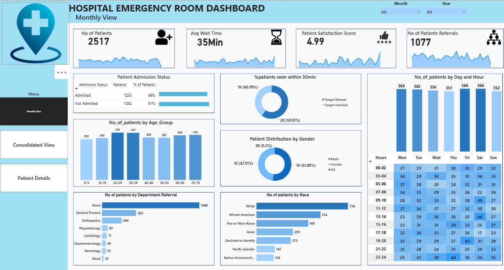
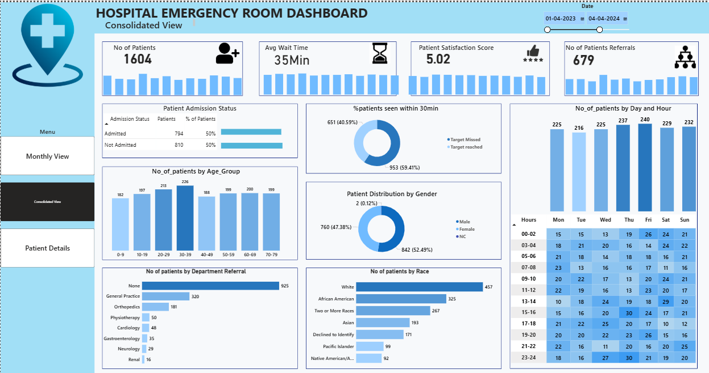
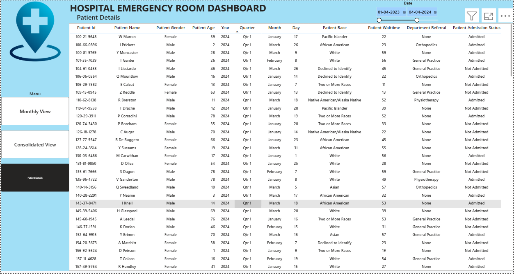

🏥 Hospital Emergency Room Dashboard – Power BI

**📌 About the Project**

This project presents an Emergency Room (ER) Dashboard developed in Power BI, using a CSV dataset covering patient visits from April 2023 to October 2024.

The dashboard provides a comprehensive view of ER performance, focusing on patient wait times, satisfaction, departmental referrals, admission patterns, and demographics. It supports hospital administrators and healthcare professionals in identifying bottlenecks, optimizing staff allocation, and improving patient experiences.

**📂 Dataset Description**

The dataset contains emergency room patient visit records covering April 2023 – October 2024 (19 months). It includes  patients name and captures demographic, operational, and satisfaction details.

Fields Included

patient_id → Unique identifier for each patient.

Patient_name→ Patient name .

Patient_age → Patient’s age in years.

Patient_gender → Gender of the patient.

Patient_race → Racial background (self-identified).

Admission_date → Date of ER visit/admission.

Admission_time → Time of patient arrival at the ER.

wait_time → Waiting time before being attended by medical staff (minutes).

department_referral → Referral destination if further treatment was required (e.g., General Practice, Orthopedics).

satisfaction_score → Patient-reported satisfaction score (scale 1–10).

Admission_status → Whether the patient was admitted to the hospital or treated-and-released.

**⚙️ Tools & Techniques**

Power BI – Data modeling, DAX, and interactive dashboard creation

Power Query – Data cleaning and transformation

CSV Dataset – Raw ER data covering 19 months (April 2023 – October 2024)

Descriptive Analysis – Trend identification and performance monitoring

**📊 Dashboard Features**

Patient Wait Time & Satisfaction – Track average wait times and patient experience ratings

Departmental Referrals – Identify most common referral departments

Peak Busy Periods – Discover busiest days and hours for resource allocation

Patient Demographics – Analyze age distribution and racial composition

Admission Patterns – Compare admitted vs. treated-and-released patients

**🔍 Key Insights (Descriptive Analysis)**

Time Period: April 2023 – October 2024 (19 months)
Dataset Size: 9,216 unique patients

**⏱️ Patient Wait Time & Satisfaction**

Average wait time: 35.3 minutes → indicates scope for reducing delays.

Average satisfaction score: 4.99 / 10 → suggests moderate satisfaction, room for improving patient experiences.

**🏥 Departmental Referrals**

No referral needed: 5,400 patients.

General Practice: 1,840 referrals.

Orthopedics: 995 referrals.

Physiotherapy: 276 referrals.

Cardiology: 248 referrals.

**📅 Peak Busy Periods**

Busiest days: Monday (1,377 patients), Saturday (1,322), Tuesday (1,318).

Busiest hours: 11 AM, 1 PM, 7 PM, 11 PM → critical for staffing decisions.

**👥 Patient Demographics**

Age Groups: 30–39 yrs (1,200 patients), 20–29 yrs (1,188 patients), 40–50 yrs significant group.

**Race Distribution:**

White: 2,571

African American: 1,951

Multi-racial: 1,557

Asian: 1,060

Declined to identify: 1,030

**🛏️ Admission Patterns**

4,612 patients admitted

4,604 patients treated and released

**📝 Summary**

The dataset reveals:

High patient volumes with nearly equal admissions and discharges.

Moderate satisfaction levels and average wait times of 35+ minutes.

Common referrals to General Practice and Orthopedics.

Peak traffic on Mondays and evenings/late nights, requiring better resource allocation.

Diverse patient demographics across age and race.

This analysis highlights opportunities to optimize staffing, reduce wait times, and improve overall ER patient care.

📷 Dashboard Preview

## 📷 Dashboard Preview  
🖥️ Dashboard Pages

The Power BI dashboard is organized into three interactive pages, each designed to provide specific insights into emergency room operations:

**Monthly View**

Displays patient trends, admissions, wait times, and satisfaction month by month.

Helps identify seasonal patterns, peak months, and performance changes over time.

**Consolidated View**

Provides a high-level overview of all ER operations.

Includes key metrics such as total patients, average wait time, satisfaction scores, referral counts, and admission rates.

Enables hospital administrators to quickly assess overall ER performance.

**Patient Details Page**

Lists individual patient records with key details: age, gender, race, wait time, satisfaction, referral, and admission status.

Useful for detailed analysis, audits, and identifying specific patient-level trends or bottlenecks.

